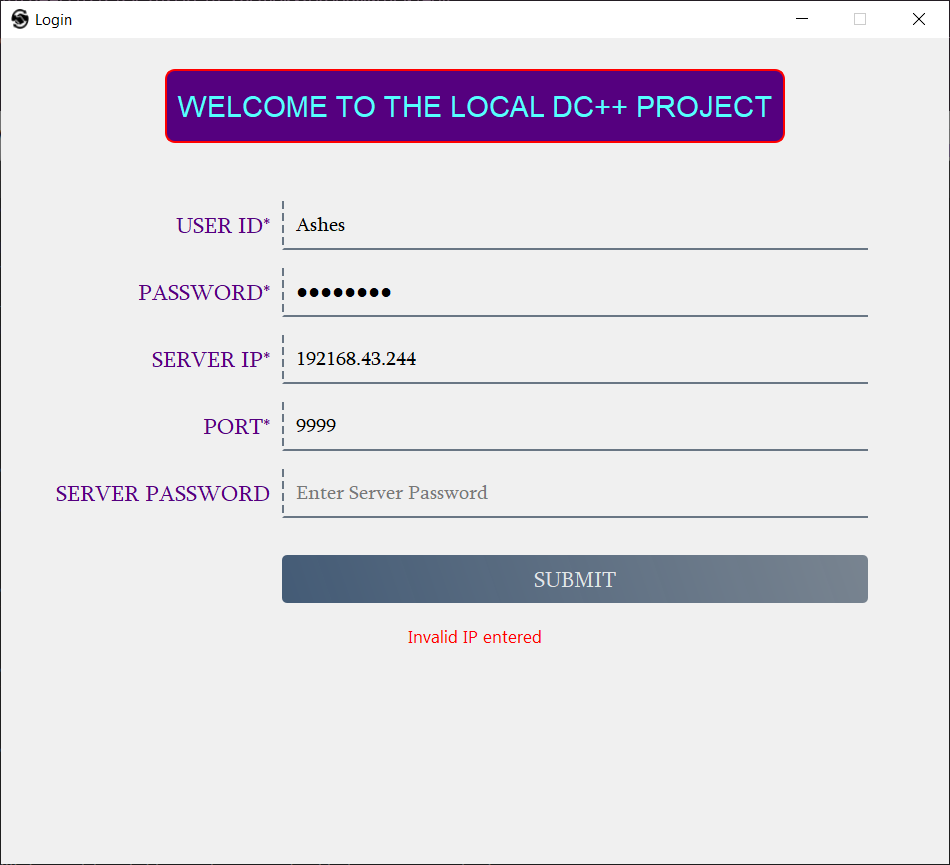
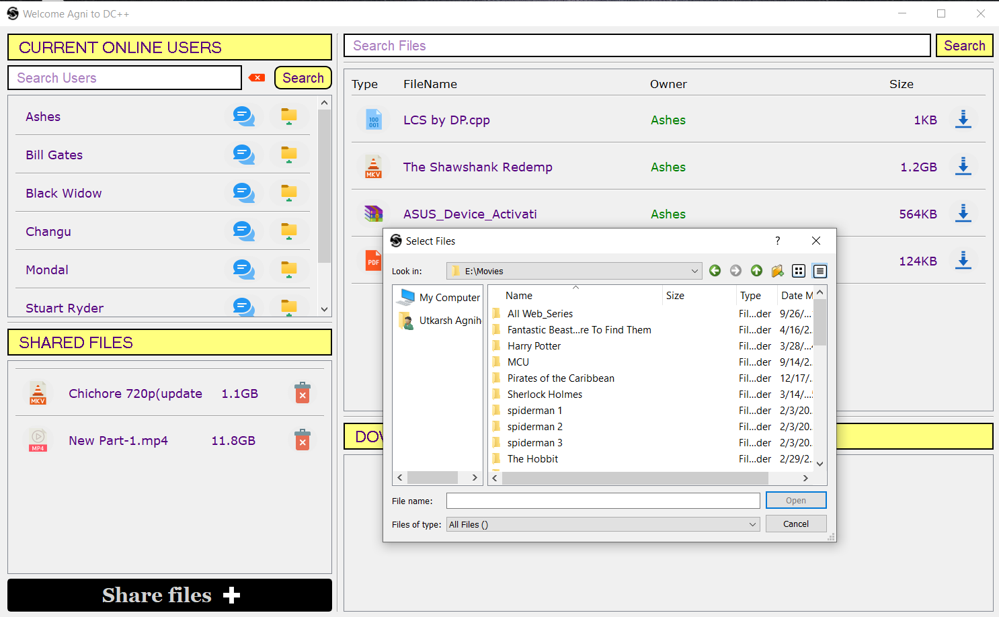
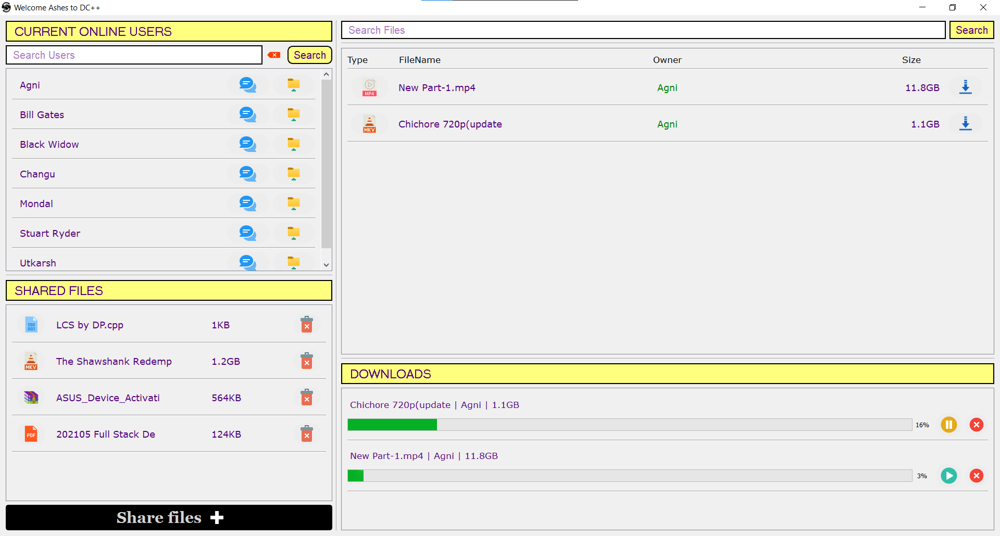
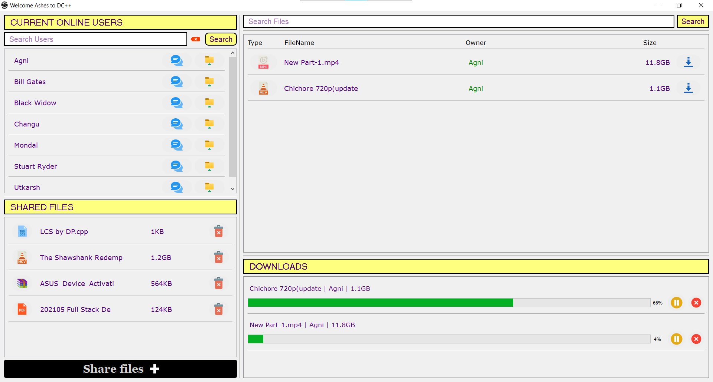
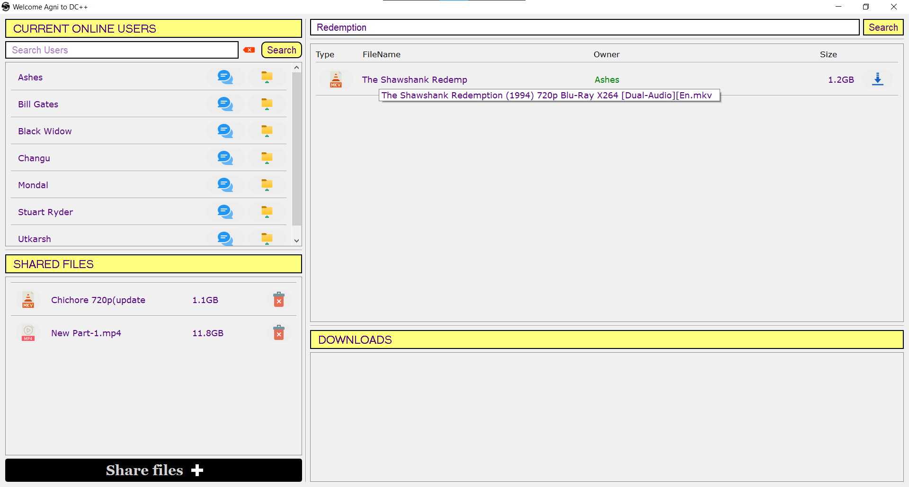
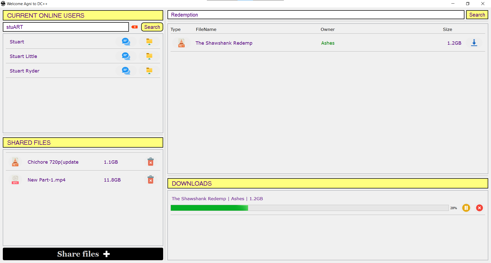
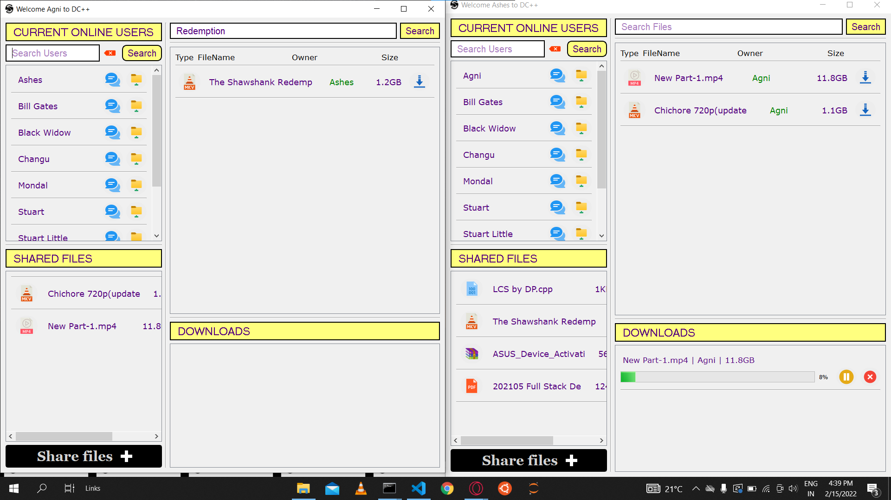
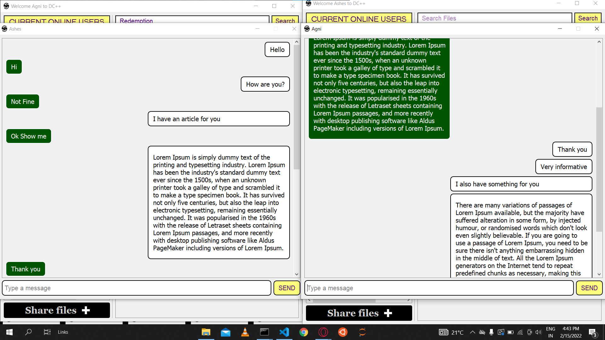
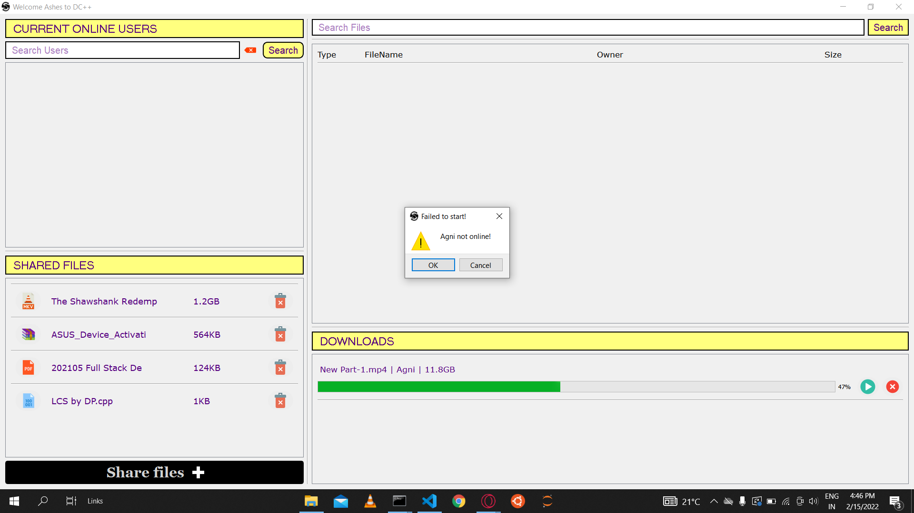

# 🦈 INTRA-SHARE 🦈

Welcome to Intra-Share, a desktop application that runs on intra-network and replicates the features of DC++. The application uses various networking, multithreading concepts, and algorithms to achieve the best file transfer speed possible. This application will run on any local area network for chatting and file-sharing purposes. Downloading speed in Intra-Share will always be higher than one can get from torrent or any other website.
#### Video Demo
https://drive.google.com/file/d/181OI4Pi7mb5Mz7dJjg2APZqd32FUAyir/view

# Team Members

-   Ashes Mondal (2019IMT-021)
-   Utkarsh Agnihotri (2019IMT-109)
-   Anurag Shrivastava (2019IMT-020)

# Features Implemented

### Frontend

-   Responsive
-   User Friendly Interface
-   Login Page
-   Select multiple files for sharing
-   Download multiple files
-   Search Functionality for users and files
-   Chatting facility
-   Scrollable, when required

### Backend

-   Secure authentication
-   Multithreading concepts
-   End to End encrypted messaging
-   Asynchronised File Sharing
-   Real time data updation
-   Updating Metadata on Database

# Technologies/Libraries/Packages Used

### UI

-   `PyQt5` for creating frontend

### In-built libraries

-   `socket` for socket programming
-   `threading` for multithreading
-   `queue` for thread safe data structure
-   `json` for sending text based structure data
-   `pickle` for serializing and de-serializing python object into binary files
-   `base64` for encoding and decoding messages
-   `time`, `sys`, `os`, `getpass`

### Encryption

-   `bcrypt` for passwords
-   `pycryptodome` for Hybrid encryption(AES + RSA)

### Database

-   `mysql-connector-python` for database

### Miscellaneous

-   `tqdm` for progress bar in console
-   `tabulate` for displaying tables in console
-   `python-dotenv` for environment variables

# Local Setup

Clone the repository

```bash
git clone https://github.com/Ashes-Mondal/Local_DC_plus_plus.git
```

Install the python modules

```bash
pip install -r requirements.txt
```

At this point you can add a `.env` file in the main directory following the `.env.example` file, and now we can run the application by first starting the server and then running the GUI:

```bash
python server.py

python app.py
```

# Screenshots

-   #### Login:

    

-   #### Share a File:

    

-   #### Downloads: Play and Paused

    

-   #### Downloads: Simultaneously

    

-   #### Search and Display File

    

-   #### Search and Display Users

    

-   #### Responsive Windows

    

-   #### Messaging Windows

    

-   #### Download Paused, user offline
    
